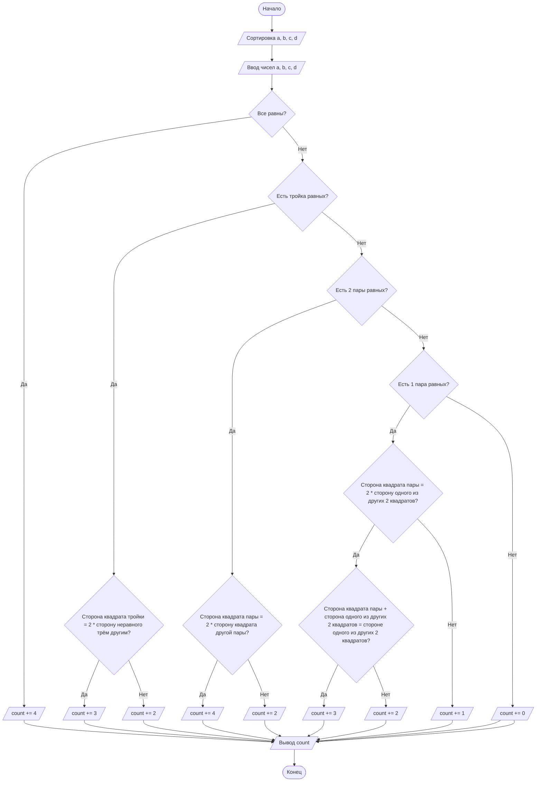

## Отчет по лабораторной работе № 1

#### № группы: `ПМ-2501`

#### Выполнил: `Локтеев Герман Юрьевич`

#### Вариант: `11`

### Cодержание:

- [Постановка задачи](#1-постановка-задачи)
- [Входные и выходные данные](#2-входные-и-выходные-данные)
- [Выбор структуры данных](#3-выбор-структуры-данных)
- [Алгоритм](#4-алгоритм)
- [Программа](#5-программа)
- [Анализ правильности решения](#6-анализ-правильности-решения)

### 1. Постановка задачи

- Условия задачи

> На вход программы подаются четыре различных квадрата с длинами сторон A, B, C, D. Определить, сколько можно сложить прямоугольников,
используя хотя бы 2 квадрата без наложений и зазоров. На вход программы подаются натуральные числа A, B, C, D.

- Я понимаю эту задачу так:

> Дают 4 натуральных числа - стороны квадратов. Нужно сопоставить квадраты так, чтобы получалось как можно больше прямоугольников, но без зазоров, наложения, вырезания, а так же использую не менее 2-х квадратов. Я буду считать прямоугольники у которых (a, b) = (b, a) за один.
- Задачу можно разбить на 5 случаев:
- Когда все квадраты равны
- Когда есть одна пара равных квадратов
- Когда есть две пары равных квадратов
- Когда есть тройка равных квадратов
- Когда все квадраты разного размера.

### 2. Входные и выходные данные

#### Данные на вход

На вход программа получает 4 натуральных числа.

|  Название   | Тип               | Min значение | Max значение   |
|-------------|-------------------|--------------|----------------|
| A (Число 1) | Натуральное число |      1       | 10<sup>9</sup> |
| B (Число 2) | Натуральное число |      1       | 10<sup>9</sup> |
| C (Число 3) | Натуральное число |      1       | 10<sup>9</sup> |
| D (Число 4) | Натуральное число |      1       | 10<sup>9</sup> |


#### Данные на выход

После работы программы мы получаем количество сложенных прямоугольник, поэтому число не может быть отрицательным, а так же оно обязательно будет целым.

| Название | Тип                         | Min значение | Max значение   |
|----------|-----------------------------|--------------|----------------|
| Число 1  | Целое неотрицательное число | 0            | 10<sup>9</sup> |

### 3. Выбор структуры данных

Т.к. программа получает на вход целое и натуральное число не превышающее 10<sup>9</sup>, то я выделю 4 переменных для их хранения (A, B, C, D) с типом `int`.

| Название    | Название переменной | Тип (в Java) | 
|-------------|---------------------|--------------|
| A (Число 1) | A                   | `int`        |
| B (Число 2) | B                   | `int`        | 
| C (Число 3) | C                   | `int`        |
| D (Число 4) | D                   | `int`        | 

### 4. Алгоритм

#### Алгоритм выполнения программы:

1. **Ввод данных:**
   Программа получает 4 натуральных числа `a`, `b`, `c`, `d`. Есть переменная `count = 0`, которая изменяется при выполнении условий.
   
2. **Программа проверяет на равенство все квадраты,** если да, то `count += 4` и выводим `count`, если нет, то проверяем дальше.

3. **Проверяем на равенство тройку квадратов,** если да, то проверяем, что одна из сторон квадратов тройки = 2 * на сторону квадрата не равного трём другим, если да, то `count += 3` и выводим `count`, если нет, то `count += 2` и выводим `count`. Если нет равенства трёх квадратов, то проверяем дальше.
   
4. **Проверяем квадраты на 2 пары равных,** если да, то проверяем, что меньшая пара = 2 * на большую пару, если да, то `count += 4` и выводим `count`, если нет, то `count += 2` и выводим `count`. Если нет 2 равных пар, проверяем дальше.
   
5. **Проверяем на наличие 1 пары равных квадратов,** если да, то проверяем что квадрат из пары = 2 * на какой-то из других 2-х квадратов, если да, то проверяем равен ли, квадрат из пары + какой-то из других 2-х квадратов = другому какому-то из этих 2-х квадратов, то `count += 3` и выводим `count`, если нет, то `count += 2` и выводим `count`. Если не выполняется ни одно из вложенных условий, то `count += 1` и выводим `count`.

6. **Если все квадраты разные, то `count = 0` и выводим `count`.**
   
#### Блок-схема



### 5. Программа

```java

import java.util.Scanner;

public class Main {
    public static void main(String[] args) {
        try (Scanner sc = new Scanner(System.in)) {
            int a = sc.nextInt();
            int b = sc.nextInt();
            int c = sc.nextInt();
            int d = sc.nextInt();

            int count = 0;
            
            if (a > 0 && b > 0 && c > 0 && d > 0) {
                int t;

                if (a > b) { t = a; a = b; b = t; }
                if (c > d) { t = c; c = d; d = t; }
                if (a > c) { t = a; a = c; c = t; }
                if (b > d) { t = b; b = d; d = t; }
                if (b > c) { t = b; b = c; c = t; }

                

                if (a == b && b == c && c == d) {
                    count += 4;
                } else {
                    if (a == b && b == c && c != d) {
                        if (a * 2 == d) count += 3;
                        else count += 2;
                    } else {
                        if (a == b && c == d) {
                            if (a * 2 == c || c * 2 == a) count += 4;
                            else count += 2;
                        } else {
                            if (a == b && c != d) {
                                if (a * 2 == c || a * 2 == d) {
                                    if (a + c == d || a + d == c) count += 3;
                                    else count += 2;
                                } else {
                                    count += 1;
                                }
                            }
                        }
                    }
                }

            }

            System.out.println(count);
        }
    }
}
```

### 6. Анализ правильности решения

Программа работает корректно на всем множестве решений с учетом ограничений.

1. Тест `A ≠ B ≠ C ≠ D > 0`
- **Input**:
   ```
   1 2 3 4
   ```
- **Output**
  ```
  0
  ```
2. Тест на `A = B = C ≠ D > 0` и `D = A * 2`
- **Input**
   ```
   1 1 1 2
   ```
- **Output**
  ```
  3
  ```
3. Тест `A = B = C ≠ D > 0` и `D ≠ A * 2`
- **Input**
  ```
  1 1 1 3
  ```
- **Output**
  ```
  2
  ```
4. Тест `A = B` и `C = D` и (`C = A * 2` или `A = C * 2`) и `A, B, C, D > 0`
- **Input**
  ```
  1 1 2 2
  ```
- **Output**
  ```
  4
  ```
5. Тест `A = B` и `C = D` и (`C ≠ A * 2` или `A ≠ C * 2`) и `A, B, C, D > 0`
- **Input**
  ```
  1 1 3 3
  ```
6. Тест `A = B ≠ C ≠ D` и (`A = C * 2` или `A = D * 2`) и (`C = A + D` или `D = A + C`) и `A, B, C, D > 0`
- **Input**
  ```
  1 1 2 3
  ```
- **Output**
  ```
  3
  ```
7. Тест `A = B ≠ C ≠ D` и (`A = C * 2` или `A = D * 2`) и (`C ≠ A + D` или `D ≠ A + C`) и `A, B, C, D > 0`
- **Input**
  ```
  1 1 2 4
  ```
- **Output**
  ```
  2
  ```
8. Тест `A = B ≠ C ≠ D` и (`A ≠ C * 2` или `A ≠ D * 2`) и (`C ≠ A + D` или `D ≠ A + C`) и `A, B, C, D > 0`
- **Input**
  ```
  1 1 3 4
  ```
- **Output**
  ```
  1
  ```
9. Тест `A = B = C = D > 0`
- **Input**
  ```
  1 1 1 1
  ```
- **Output**
  ```
  4
  ```
10. Тест на ограничение
- **Input**
  ```
  1000000000, 1000000000, 1000000000, 1000000000
  ```
- **Output**
  ```
  4
  ```
